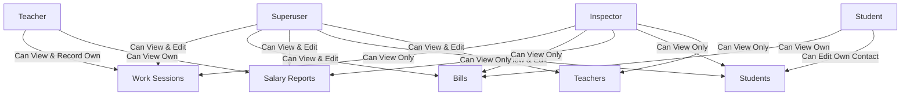

# Teachers Management Web Application

## Overview

This project is a web application for managing teachers, their work records, salary reports, and student information. It is built primarily in Python using the Django framework for the backend, and HTML, CSS, and JavaScript for the frontend.

## Features

- Teacher authentication and dashboard
- Record and view work logs 
- Generate and view teacher salary reports
- Manage student records (add, edit, remove)
- Role-based access (teacher, superuser/admin, inspector)
- Superusers can:
  - Open and delete student and teacher accounts
  - Create, edit, and remove taxes and services
  - Perform billing
  - Record work sessions for teachers
  - Calculate teacher salaries
  - Generate and update salary reports for teachers
    - Creating a new salary report for a period will replace any existing report for that period
    - Changes to prices or teacher rates will not affect previously generated bills or salary reports; historical values are preserved for accurate record-keeping
  - **Bulk Bill All Students:** Generate bills for all students for a selected month in one click, with a preview and options to update or skip existing bills. Prevents double billing and allows reviewing actions before confirming.
  - **Bulk Salary Reports for All Teachers:** Create or update salary reports for all teachers for a selected month in one click, with a preview and options to update or skip existing reports. Paid reports require explicit confirmation to update. Supervisor can select any month/year.
  - **Flexible Month/Year Selection:** On both bulk billing and salary reporting, select any month and year before previewing or confirming the operation. Default is previous month, but supervisor can generate reports at any time.
  - **Dashboard Shortcuts:** Prominent buttons for both bulk billing and bulk salary reports are available in the left column of the superuser dashboard for quick access.
- Inspectors can:
  - View all work sessions (for any teacher)
  - View all bills (for any student)
  - View all salary reports (for any teacher)
  - View all student and teacher records
  - Inspectors **cannot** add, edit, or delete any data (read-only access)
- Teachers can:
  - Record work sessions for themselves and view them
    - (This feature can be deactivated for some schools/tutoring centers)
  - View their own salary reports
- Students can:
  - View their own bills
  - Edit their own contact information (telephone, email)

## Flowcharts & Visual Guides

### 1. User Roles & Permissions



### 2. Billing Process Flowchart

```mermaid
flowchart TD
    StartBilling[Start Billing Process]
    SelectMonth[Select Month/Year]
    ChooseStudent[Choose Student]
    PreviewBills[Preview Bills]
    ConfirmBilling{Confirm Billing}
    GenerateBills[Generate Bills]
    Notify[Notify Students]
    EndBilling[End]

    StartBilling --> SelectMonth
    SelectMonth --> ChooseStudent
    ChooseStudent --> PreviewBills
    PreviewBills --> ConfirmBilling
    ConfirmBilling -- Yes --> GenerateBills
    GenerateBills --> Notify
    Notify --> EndBilling
    ConfirmBilling -- No --> EndBilling
  ```

### 3. Salary Report Generation Flowchart

```mermaid
flowchart TD
    StartSalary[Start Salary Report Generation]
    SelectPeriod[Select Month/Year]
    ChooseTeacher[Choose Teacher]
    PreviewReports[Preview Reports]
    ConfirmReports{Confirm Generation}
    GenerateReports[Generate Salary Reports]
    NotifyTeachers[Notify Teachers]
    EndSalary[End]

    StartSalary --> SelectPeriod
    SelectPeriod --> ChooseTeacher
    ChooseTeacher --> PreviewReports
    PreviewReports --> ConfirmReports
    ConfirmReports -- Yes --> GenerateReports
    GenerateReports --> NotifyTeachers
    NotifyTeachers --> EndSalary
    ConfirmReports -- No --> EndSalary
```

## Tech Stack

- **Backend:** Python (Django)
- **Frontend:** HTML, CSS, JavaScript (Django templating)
- **Database:** SQLite (default, can be switched to PostgreSQL/MySQL)

## Getting Started

### Prerequisites

- Python 3.x
- pip (Python package manager)

### Installation

1. Clone the repository:
   ```bash
   git clone https://github.com/yourusername/teachers.git
   cd teachers
   ```

2. Install dependencies:
   ```bash
   pip install -r requirements.txt
   ```

3. Apply migrations to set up the database:
   ```bash
   python manage.py migrate
   ```

4. Create a superuser to access the admin panel:
   ```bash
   python manage.py createsuperuser
   ```

5. Run the development server:
   ```bash
   python manage.py runserver
   ```

6. Access the application at `http://127.0.0.1:8000`

## Folder Structure

- `templates/` - HTML templates
- `static/` - Static files (CSS, JS, images)
- `teachers/` - Main Django app
- `manage.py` - Django project entry point
- `requirements.txt` - Python dependencies

## Contributing

Contributions are welcome! Please open issues or submit pull requests.

## License

To be decided. The license for this project has not been chosen yet.
